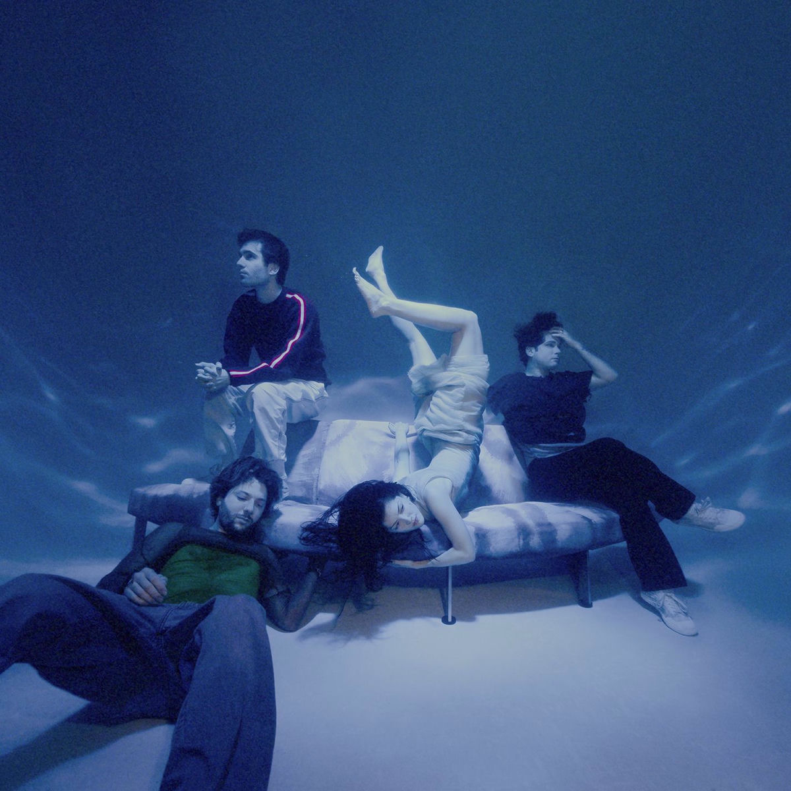

# ♡ Music Player Widget

> A beautiful, frameless Electron music player widget that floats on your desktop with a soft pink aesthetic designed for everyone.



> ⚠️ **Note:** This is an **Electron desktop application**. It cannot be deployed on Vercel or other web hosting platforms. Vercel only hosts web applications (Next.js, React, etc.), not desktop apps. This project must be run locally or packaged for distribution.

## ✨ Features

- **🎨 Stunning Pink Theme** - Soft, elegant pink gradients and glass-morphism effects
- **💫 Smooth Animations** - Floating decorations, sparkle effects, and buttery transitions
- **🎵 49 Songs Included** - Pre-loaded with albums from The Marías, Mitski, and The Smiths (streaming from Cloudflare R2 CDN)
- **📋 Queue System** - Filter by artist, see song durations, click to play
- **❤️ Favorites** - Heart buttons to mark your favorite moments
- **🪟 Desktop Widget** - Floating, always-accessible player
- **🎮 Full Controls** - Play/pause, previous/next, seek bar, volume

## 🚀 Quick Start

```bash
# Install dependencies
npm install

# Run the app
npm start
```

## 📦 Build for Distribution

```bash
# Build for Windows
npm run build:win

# Build for Mac
npm run build:mac

# Build for both
npm run build:all
```

## 🎯 Controls

| Action | Control |
|--------|---------|
| Play/Pause | Click center button |
| Next Song | Click right arrow |
| Previous Song | Click left arrow |
| Seek | Drag progress bar |
| Volume | Drag volume slider or click icon to mute |
| Favorites | Click heart buttons |
| Queue | Click "Queue" button |
| Filter Songs | Click artist filters in queue |
| Minimize | Click minimize (−) button |
| Close | Click close (×) button |

## 🎨 UI Features

- **Decorative Flowers** - Cute animated flowers on album art
- **Sparkle Effects** - Glowing sparkle decorations
- **Floating Bow** - Animated bow above album art
- **Glass Morphism** - Frosted glass background effects
- **Equalizer Animation** - Visual audio bars for playing song
- **Marquee Title** - Long titles scroll smoothly

## 🎵 Music Source

Music is streamed from Cloudflare R2 CDN. No local audio files required.

## 🛠️ Tech Stack

- **Electron** - Desktop app framework
- **HTML/CSS/JS** - Frontend
- **Cloudflare R2** - Audio streaming CDN
- **electron-builder** - Packaging & distribution

## 📝 License

MIT License - Feel free to use, modify, and share!

## 🙏 Credits

Songs included (for demonstration, streamed from CDN):
- **The Marías** - Submarine album
- **Mitski** - Laurel Hell album  
- **The Smiths** - Louder Than Bombs album

---

*Made with ♡ and pink sparkles*
